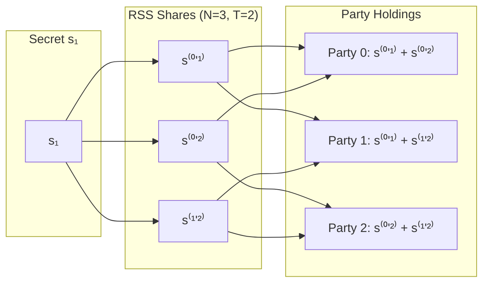
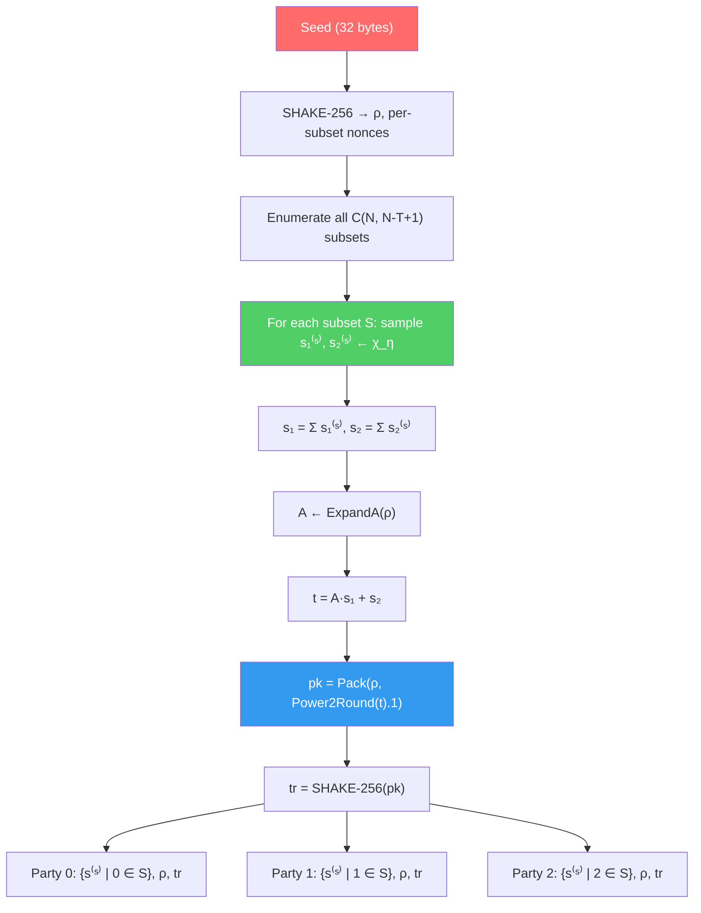
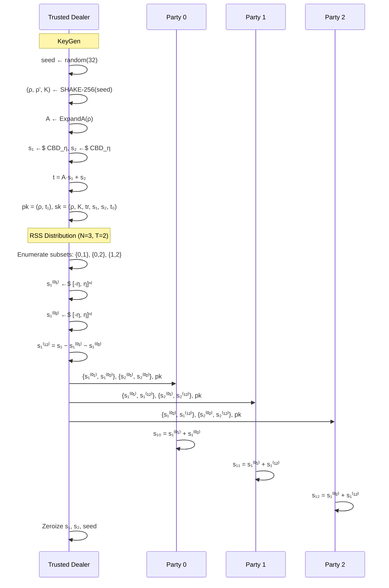
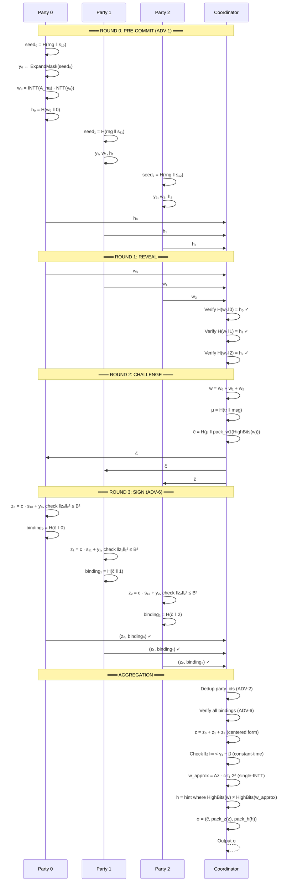
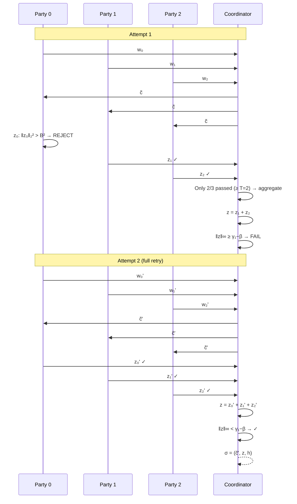
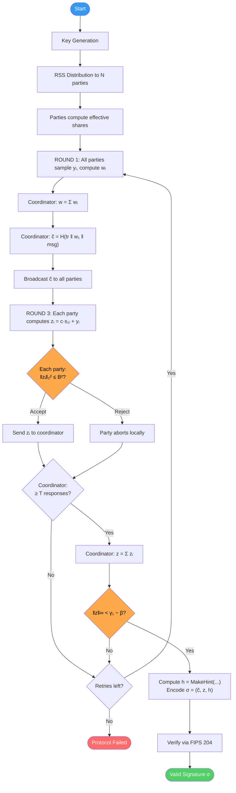
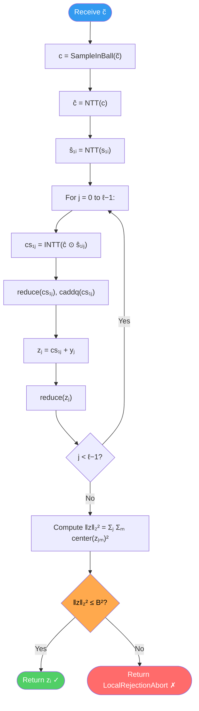
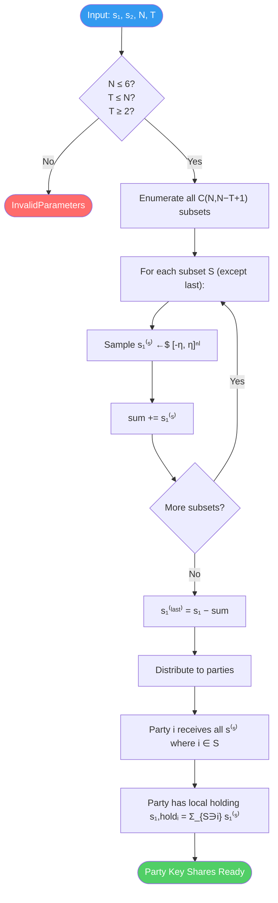

# Threshold ML-DSA Protocol Specification

> **Based on:** FIPS 204 (ML-DSA) + ePrint 2026/013 (Mithril Scheme)
>
> This document describes the cryptographic protocol implemented in
> `threshold-ml-dsa` v0.3.0, covering fresh key generation via Replicated
> Secret Sharing, the 3-round threshold signing protocol with K-parallel
> hyperball commitments, and FIPS 204-compatible verification.

---

## Table of Contents

1. [Notation and Parameters](#1-notation-and-parameters)
2. [Algebraic Foundation](#2-algebraic-foundation)
3. [Standard ML-DSA (FIPS 204)](#3-standard-ml-dsa-fips-204)
4. [Why Threshold Lattice Signing Is Hard](#4-why-threshold-lattice-signing-is-hard)
5. [Replicated Secret Sharing (RSS)](#5-replicated-secret-sharing-rss)
6. [Threshold Key Generation](#6-threshold-key-generation)
7. [Threshold Signing Protocol (4 Rounds)](#7-threshold-signing-protocol-4-rounds)
8. [Hyperball Rejection Sampling](#8-hyperball-rejection-sampling)
9. [Signature Aggregation and Encoding](#9-signature-aggregation-and-encoding)
10. [Verification](#10-verification)
11. [Adversarial Security Hardening](#11-adversarial-security-hardening)
12. [Sequence Diagrams](#12-sequence-diagrams)
13. [Activity Diagrams](#13-activity-diagrams)
14. [Security Properties](#14-security-properties)
15. [SDK Integration Layer](#15-sdk-integration-layer)

---

## 1. Notation and Parameters

### Symbols

| Symbol | Meaning |
|--------|---------|
| $\mathbb{Z}_q$ | Integers modulo $q$ |
| $R_q$ | Ring $\mathbb{Z}_q[X]/(X^{256}+1)$ |
| $\mathbf{s}_1 \in R_q^\ell$ | Secret key vector (short, $\eta$-bounded) |
| $\mathbf{s}_2 \in R_q^k$ | Secret key vector (short, $\eta$-bounded) |
| $\mathbf{A} \in R_q^{k \times \ell}$ | Public matrix (expanded from seed $\rho$) |
| $\mathbf{t} = \mathbf{A}\mathbf{s}_1 + \mathbf{s}_2$ | Public key vector |
| $c \in R_q$ | Challenge polynomial ($\tau$ non-zero $\pm 1$ coefficients) |
| $\mathbf{y} \in R_q^\ell$ | Masking vector ($\gamma_1$-bounded) |
| $\mathbf{z} = c \cdot \mathbf{s}_1 + \mathbf{y}$ | Signature response vector |
| $\lVert \cdot \rVert_2$ | Euclidean (L₂) norm |
| $\lVert \cdot \rVert_\infty$ | Infinity (L∞) norm |

### ML-DSA-44 Parameters

| Parameter | Symbol | Value | Description |
|-----------|--------|-------|-------------|
| Modulus | $q$ | $8{,}380{,}417 = 2^{23} - 2^{13} + 1$ | Prime for $\mathbb{Z}_q$ |
| Ring degree | $n$ | $256$ | Polynomial degree |
| Matrix rows | $k$ | $4$ | Rows in **A** |
| Matrix cols | $\ell$ | $4$ | Columns in **A** |
| Secret bound | $\eta$ | $2$ | $\mathbf{s}_1, \mathbf{s}_2 \in [-\eta, \eta]^n$ |
| Challenge weight | $\tau$ | $39$ | Non-zero entries in $c$ |
| Masking bound | $\gamma_1$ | $2^{17} = 131{,}072$ | $\mathbf{y} \in [-\gamma_1+1, \gamma_1]^n$ |
| Decompose param | $\gamma_2$ | $(q-1)/88 = 95{,}232$ | For HighBits/LowBits |
| Norm bound | $\beta$ | $\tau \cdot \eta = 78$ | $\lVert c \cdot \mathbf{s} \rVert_\infty \leq \beta$ |
| Rounding bits | $d$ | $13$ | Power2Round parameter |
| Hint budget | $\omega$ | $80$ | Max hint ones |

### Threshold-Specific Parameters (Figure 8)

| Parameter | Symbol | Description |
|-----------|--------|-------------|
| Max parties | $N_{\max}$ | $6$ (upper bound on $N$) |
| K repetitions | $K$ | Parallel commitment slots (2–100, depends on (T,N)) |
| Hyperball radius | $r$ | ν-scaled L₂ norm bound for response rejection |
| Commitment radius | $r_1$ | ν-scaled L₂ norm bound for randomness sampling |
| Expansion factor | $\nu$ | 3 for ML-DSA-44 (scales first L·N coordinates) |

---

## 2. Algebraic Foundation

### The Ring $R_q$

All arithmetic takes place in the polynomial ring:

$$R_q = \mathbb{Z}_q[X] / (X^{256} + 1)$$

Elements are polynomials of degree $< 256$ with coefficients in $\mathbb{Z}_q$. Multiplication is polynomial multiplication modulo $X^{256} + 1$.

### Number Theoretic Transform (NTT)

Polynomial multiplication is accelerated via the NTT. For $a, b \in R_q$:

$$a \cdot b = \text{NTT}^{-1}(\text{NTT}(a) \circ \text{NTT}(b))$$

where $\circ$ denotes coefficient-wise (pointwise) multiplication in the NTT domain using Montgomery reduction:

$$\text{PointwiseMont}(\hat{a}_i, \hat{b}_i) = \hat{a}_i \cdot \hat{b}_i \cdot R^{-1} \bmod q$$

with Montgomery constant $R = 2^{32}$.

### Norms

For a polynomial $p \in R_q$ with centered coefficients $p_0, \ldots, p_{255}$:

$$\lVert p \rVert_2^2 = \sum_{i=0}^{255} p_i^2 \qquad \lVert p \rVert_\infty = \max_{i} |p_i|$$

For a vector $\mathbf{v} = (v_0, \ldots, v_{\ell-1}) \in R_q^\ell$:

$$\lVert \mathbf{v} \rVert_2^2 = \sum_{j=0}^{\ell-1} \lVert v_j \rVert_2^2 \qquad \lVert \mathbf{v} \rVert_\infty = \max_{j} \lVert v_j \rVert_\infty$$

### Centering

Coefficients are stored in $[0, q)$ but centered to $[-(q-1)/2, (q-1)/2]$ for norm computations:

$$\text{center}(a) = \begin{cases} a & \text{if } a \leq (q-1)/2 \\ a - q & \text{if } a > (q-1)/2 \end{cases}$$

---

## 3. Standard ML-DSA (FIPS 204)

### 3.1 Key Generation

```
KeyGen(seed):
    (ρ, ρ', K) ← SHAKE-256(seed)
    A ← ExpandA(ρ)                        // A ∈ R_q^{k×ℓ}
    s₁ ← SampleShort(ρ', η, 0..ℓ)        // s₁ ∈ R_q^ℓ,  coeffs ∈ [-η, η]
    s₂ ← SampleShort(ρ', η, ℓ..ℓ+k)     // s₂ ∈ R_q^k,  coeffs ∈ [-η, η]
    t = A·s₁ + s₂                         // t ∈ R_q^k
    (t₁, t₀) = Power2Round(t, d)
    pk = (ρ, t₁)
    tr = SHAKE-256(pk)
    sk = (ρ, K, tr, s₁, s₂, t₀)
    return (pk, sk)
```

**Math:**

$$\mathbf{t} = \mathbf{A} \cdot \mathbf{s}_1 + \mathbf{s}_2 \in R_q^k$$

$$\mathbf{t} = \mathbf{t}_1 \cdot 2^d + \mathbf{t}_0 \quad \text{(Power2Round)}$$

### 3.2 Standard Signing

```
Sign(sk, msg):
    μ = SHAKE-256(tr ‖ msg)
    ρ' = SHAKE-256(K ‖ rnd ‖ μ)
    κ ← 0
    loop:
        y ← ExpandMask(ρ', κ)             // y ∈ S_{γ₁}^ℓ
        w = A · NTT(y)
        w₁ = HighBits(w)
        c̃ = SHAKE-256(μ ‖ w₁_packed)
        c = SampleInBall(c̃)               // τ non-zero ±1 coefficients
        z = y + c · s₁
        if ‖z‖∞ ≥ γ₁ - β: κ += ℓ; continue
        r₀ = LowBits(w - c·s₂)
        if ‖r₀‖∞ ≥ γ₂ - β: κ += ℓ; continue
        h = MakeHint(...)
        if |h| > ω: κ += ℓ; continue
        return σ = (c̃, z, h)
```

**Core equation (Fiat-Shamir with aborts):**

$$\mathbf{z} = \mathbf{y} + c \cdot \mathbf{s}_1$$

**Rejection conditions:**

$$\lVert \mathbf{z} \rVert_\infty < \gamma_1 - \beta$$

### 3.3 Verification

```
Verify(pk, msg, σ = (c̃, z, h)):
    if ‖z‖∞ ≥ γ₁ - β: return ⊥
    A ← ExpandA(ρ)
    μ = SHAKE-256(tr ‖ msg)
    c = SampleInBall(c̃)
    w₁' = UseHint(h, A·z - c·t₁·2^d)
    c̃' = SHAKE-256(μ ‖ w₁'_packed)
    return c̃ == c̃'    (constant-time)
```

**Verification equation:**

$$\mathbf{A} \cdot \mathbf{z} - c \cdot \mathbf{t}_1 \cdot 2^d \equiv \mathbf{A}\mathbf{y} + c(\mathbf{A}\mathbf{s}_1 + \mathbf{s}_2) - c \cdot \mathbf{t} \cdot 2^d$$

---

## 4. Why Threshold Lattice Signing Is Hard

### The Shamir Problem

In Shamir $(T, N)$-sharing, reconstruction uses Lagrange coefficients $\lambda_i$:

$$s = \sum_{i \in \mathcal{Q}} \lambda_i \cdot s_i$$

For lattice schemes, this is catastrophic because $\lambda_i$ can be large integers.
If $\lVert s \rVert_\infty \leq \eta$ and $|\lambda_i| \gg 1$, then:

$$\lVert \lambda_i \cdot s_i \rVert_\infty = |\lambda_i| \cdot \lVert s_i \rVert_\infty \gg \eta$$

This **blows up** the coefficient magnitudes, making the response $z_i = y_i + c \cdot \lambda_i \cdot s_i$ far too large to pass the FIPS 204 norm checks.

### The Mithril Solution

**Replicated Secret Sharing (RSS)** avoids Lagrange multipliers entirely:

- Secret is split into $\binom{N}{N-T+1}$ additive pieces — one per $(N-T+1)$-subset
- Each piece is **short by construction** (bounded by $\eta$)
- Reconstruction is **pure addition** — no multipliers needed
- Each party's local holding is bounded by $\binom{N-1}{N-T} \cdot \eta$

---

## 5. Replicated Secret Sharing (RSS)

### 5.1 Subset Structure

For $(N, T)$-threshold, define $M = N-T+1$ and enumerate all $M$-subsets of $\{0, \ldots, N-1\}$:

$$\mathcal{S}_M = \{ S \subseteq \{0,\ldots,N-1\} : |S| = M \}$$

$$|\mathcal{S}_M| = \binom{N}{M} = \binom{N}{N-T+1}$$

**Example** $(N=3, T=2)$:

$$M=2,\ \mathcal{S}_2 = \left\{ \{0,1\},\ \{0,2\},\ \{1,2\} \right\} \qquad |\mathcal{S}_2| = 3$$

### 5.2 Share Distribution (v0.3 — Paper-Faithful)

In v0.3, secrets are generated **fresh and independently** per subset from a shared seed.
This matches the paper's Figure 4 construction:

$$\text{For each } S \in \mathcal{S}_M: \quad \mathbf{s}_1^{(S)} \xleftarrow{\text{SHAKE-256}} [-\eta, \eta]^{n \cdot \ell}$$

The per-subset secrets are sampled independently using SHAKE-256 with a domain-separated
nonce per subset. The total secret is defined as:

$$\mathbf{s}_1 = \sum_{S \in \mathcal{S}_M} \mathbf{s}_1^{(S)}, \qquad \mathbf{s}_2 = \sum_{S \in \mathcal{S}_M} \mathbf{s}_2^{(S)}$$

**Party $i$ receives:** all shares $\mathbf{s}^{(S)}$ for subsets $S \ni i$.

### 5.3 Per-Party Effective Share

Party $i$'s effective secret share is:

$$\mathbf{s}_{1,i}^{\text{hold}} = \sum_{\substack{S \in \mathcal{S}_M \\ i \in S}} \mathbf{s}_1^{(S)}$$

Party $i$ participates in $\binom{N-1}{M-1}=\binom{N-1}{N-T}$ subsets, so:

$$\lVert \mathbf{s}_{1,i}^{\text{hold}} \rVert_\infty \leq \binom{N-1}{N-T} \cdot \eta$$

**Example** $(N=3, T=2)$: Each party holds $\binom{2}{1} = 2$ shares, so $\lVert \mathbf{s}^{\text{hold}}_{1,i} \rVert_\infty \leq 2 \cdot 2 = 4$.

### 5.4 Reconstruction

Any $T$ qualifying parties collectively cover **all** $\binom{N}{N-T+1}$ subsets. Each share piece is replicated across all members of its subset, so any one member can provide it:

$$\mathbf{s}_1 = \sum_{S \in \mathcal{S}_M} \mathbf{s}_1^{(S)} = \sum_{\text{one copy per subset from qualifying parties}}$$



---

## 6. Threshold Key Generation (v0.3 — Figure 4)



### Step-by-Step

**Step 1 — Derive seed material:**

$$(\rho, \text{nonce\_base}) \leftarrow \text{SHAKE-256}(\text{seed})$$

**Step 2 — Fresh per-subset secret generation:**

For each subset $S \in \mathcal{S}_M$ (enumerated via Gosper's hack bitmask):

$$\mathbf{s}_1^{(S)} \leftarrow \text{SHAKE-256}(\text{seed} \| S)_{\eta} \quad \text{(independently)}$$
$$\mathbf{s}_2^{(S)} \leftarrow \text{SHAKE-256}(\text{seed} \| S)_{\eta} \quad \text{(independently)}$$

> **Note:** No existing ML-DSA key is decomposed. All secrets are fresh.

**Step 3 — Compute public key:**

$$\mathbf{s}_1 = \sum_{S} \mathbf{s}_1^{(S)}, \quad \mathbf{s}_2 = \sum_{S} \mathbf{s}_2^{(S)}$$
$$\mathbf{A} \leftarrow \text{ExpandA}(\rho)$$
$$\mathbf{t} = \mathbf{A}\mathbf{s}_1 + \mathbf{s}_2$$
$$pk = (\rho, \text{Power2Round}(\mathbf{t}).1), \quad tr = \text{SHAKE-256}(pk)$$

**Step 4 — Distribute to parties:**

$$\text{Party } i \text{ receives: } \{\mathbf{s}_1^{(S)}, \mathbf{s}_2^{(S)} : i \in S\}, \rho, tr$$

---

## 7. Threshold Signing Protocol (3 Rounds + K-Parallel)

The v0.3 protocol runs in **3 rounds** with **K parallel commitment slots** per round.
This follows the construction in ePrint 2026/013 exactly.

### 7.1 Round 1 — Commit (K Parallel Hyperball Commitments)

Each party $P_i$ independently generates K commitments:

**Sample K hyperball vectors:**

For $k = 0, \ldots, K-1$:

$$(\mathbf{r}_k, \mathbf{e}_k) \leftarrow \text{SampleHyperball}(r_1, \nu, \rho', k)$$

where SampleHyperball uses the Box-Muller transform to generate a Gaussian direction
vector, then normalizes and scales to radius $r_1$. The first $L \cdot N$
coordinates are scaled by $\nu$ to account for the response magnification.

**Compute K commitments:**

$$\mathbf{w}_{i,k} = \mathbf{A} \cdot \mathbf{r}_k + \mathbf{e}_k \in R_q^k$$

**Compute binding hash:**

$$h_i = \text{SHAKE-256}(tr \| i \| \mathbf{w}_{i,0} \| \ldots \| \mathbf{w}_{i,K-1})$$

**Send** $h_i$ to coordinator. **Store** K FVec samples locally.

### 7.2 Round 2 — Reveal

**Send** all K packed commitment vectors $\mathbf{w}_{i,k}$ to coordinator.

**Compute** $\mu = \text{CRH}(tr \| \text{msg})$.

### 7.3 Round 3 — Respond (K Parallel with FVec Rejection)

Each party $P_i \in \mathcal{A}$:

**Recover partial secret** via Algorithm 6 (balanced partition):

$$\{S_1, \ldots, S_m\} \leftarrow \text{RSSRecover}(\mathcal{A}, N, T)$$

$$(\mathbf{s}_{1,I}, \mathbf{s}_{2,I}) = \sum_{j \in \text{partition}[i]} (\mathbf{s}_1^{(S_j)}, \mathbf{s}_2^{(S_j)})$$

**For each** $k = 0, \ldots, K-1$:

1. Decompose $\mathbf{w}_{\text{final},k}$ and compute challenge:

$$\tilde{c}_k = \text{SHAKE-256}(\mu \| \text{pack}(\text{HighBits}(\mathbf{w}_{\text{final},k})))$$

$$c_k = \text{SampleInBall}(\tilde{c}_k)$$

2. Compute response as FVec:

$$\mathbf{z}^{(f)}_{i,k} = (c_k \cdot \mathbf{s}_{1,I},\ c_k \cdot \mathbf{s}_{2,I}) + \text{FVec}_k$$

3. ν-scaled hyperball rejection:

$$\text{If } \text{Excess}(\mathbf{z}^{(f)}_{i,k}, r, \nu): \quad \mathbf{z}_{i,k} \leftarrow \mathbf{0}$$

where $\text{Excess}(\mathbf{v}, r, \nu)$ computes:

$$\sum_{j < L \cdot N} \frac{v_j^2}{\nu^2} + \sum_{j \geq L \cdot N} v_j^2 > r^2$$

**Send** K response vectors $\{\mathbf{z}_{i,k}\}$ to coordinator.

> [!IMPORTANT]
> The L∞ check $\lVert \mathbf{z} \rVert_\infty < \gamma_1 - \beta$ is applied only to the
> **aggregated** $\mathbf{z}$ by the coordinator, not per-party.
> Share assignment uses balanced partitions (Algorithm 6) to prevent double-counting.

---

## 8. Hyperball Rejection Sampling (FVec + Box-Muller)

### The Exponential Degradation Problem

Standard ML-DSA uses **hypercube** rejection: accept iff $\lVert \mathbf{z} \rVert_\infty < \gamma_1 - \beta$.

In a threshold setting with $T$ parties, each performing independent L∞-rejection, the combined acceptance probability is:

$$p_{\text{cube}} = \left(\frac{\gamma_1 - \beta}{\gamma_1}\right)^{T \cdot \ell \cdot n}$$

This decays **exponentially** in $T$ — for $T = 3$, $p_{\text{cube}}$ is negligible.

### The Hyperball Solution (ePrint 2026/013)

Replace the hypercube with a **ν-scaled hyperball** using float vectors (FVec):

$$\text{Accept iff } \sum_{j < L \cdot N} \frac{z_j^2}{\nu^2} + \sum_{j \geq L \cdot N} z_j^2 \leq r^2$$

The ν-scaling accounts for the larger response magnitudes in the first $L \cdot N$
coordinates (which correspond to the transmitted z vector).

### SampleHyperball (Box-Muller)

To sample uniformly on the hyperball surface:

1. Generate $d + 2$ Gaussian samples via Box-Muller transform
2. Scale the first $L \cdot N$ coordinates by $\nu$
3. Normalize to the unit sphere
4. Scale by radius $r_1$

This produces a uniformly distributed point on the surface of the ν-scaled
hyperball, matching the Go reference `SampleHyperball()` function.

### K-Parallel Amortization

Instead of retrying the entire protocol on rejection, each party generates **K**
independent hyperball samples. The coordinator tries each of the K slots,
accepting the first one that produces a valid FIPS 204 signature. This
dramatically improves per-round success probability.

### Numerical Values (ML-DSA-44, from Figure 8)

| (T, N) | K | Radius r | Per-slot acceptance |
|--------|---|----------|---------------------|
| (2, 2) | 2 | 252,778 | ~50% |
| (3, 3) | 5 | 252,131 | ~20% |
| (4, 4) | 14 | 251,338 | ~7% |
| (5, 5) | 42 | 250,590 | ~2.4% |
| (6, 6) | 100 | 250,590 | ~1% |

---

## 9. Signature Aggregation and Encoding

### Aggregation (Coordinator)

**Step 1 — Validate partials:**

- **ADV-2 (Sybil):** Deduplicate by `party_id` — reject duplicate submissions
- **ADV-6 (Replay):** Verify each session binding: $\text{SHAKE-256}(\tilde{c} \| i) \stackrel{?}{=} \text{binding}_i$

**Step 2 — Sum:**

$$\mathbf{z} = \sum_{i \in \mathcal{Q}} \mathbf{z}_i = \sum_i (\mathbf{y}_i + c \cdot \mathbf{s}_{1,i}) = \sum_i \mathbf{y}_i + c \cdot \sum_i \mathbf{s}_{1,i}$$

Since $\sum_i \mathbf{s}_{1,i} = \mathbf{s}_1$ (RSS reconstruction via signing):

$$\mathbf{z} = \Big(\sum_i \mathbf{y}_i\Big) + c \cdot \mathbf{s}_1$$

This is **exactly** the standard ML-DSA response with the aggregate masking $\mathbf{y} = \sum_i \mathbf{y}_i$.

> [!WARNING]
> After summation, $\mathbf{z}$ must remain in **centered form** (via `reduce()` only, no `caddq()`). The `pack_z` function computes $\gamma_1 - z_{\text{coeff}}$ which requires centered coefficients in $[-(\gamma_1-1), \gamma_1]$. Mapping to $[0, q)$ via `caddq()` produces garbage.

**Step 3 — L∞ check on aggregate (constant-time):**

$$\lVert \mathbf{z} \rVert_\infty < \gamma_1 - \beta$$

If this fails, the entire protocol is retried.

### Hint Computation ($\mathbf{h}$)

FIPS 204 mandates the encoding of a hint vector $\mathbf{h}$. Because threshold signers do not distribute $\mathbf{s}_2$ or $\mathbf{t}_0$, the coordinator derives the approximation exactly as the verifier does:

$$\mathbf{w}_{\text{approx}} = \mathbf{A} \cdot \mathbf{z} - c \cdot \mathbf{t}_1 \cdot 2^d$$

> [!IMPORTANT]
> The subtraction is performed **in the NTT domain** with a single INTT at the end, matching the reference verification path exactly.
> The shift $\mathbf{t}_1 \cdot 2^d$ uses plain `<<=` without modular reduction, matching the reference `polyveck_shiftl`.

The hint bit is set where $\text{HighBits}(\mathbf{w}) \neq \text{HighBits}(\mathbf{w}_{\text{approx}})$. The `use_hint` function in the verifier corrects the discrepancy using the sign of $\text{LowBits}(\mathbf{w}_{\text{approx}})$.

### FIPS 204 Encoding

The final signature is encoded as:

$$\sigma = \tilde{c}\ \|\ \text{pack}_z(\mathbf{z})\ \|\ \text{pack}_h(\mathbf{h})$$

| Field | Size (bytes) | Encoding |
|-------|-------------|----------|
| $\tilde{c}$ | 32 | Raw challenge hash |
| $\mathbf{z}$ | $\ell \times 576 = 2{,}304$ | 18 bits/coefficient (centered, $\gamma_1$-bounded) |
| $\mathbf{h}$ | $\omega + k = 84$ | Sparse hint: ascending indices per polynomial |
| **Total** | **2,420** | Identical to standard ML-DSA-44 |

---

## 10. Verification

The threshold signature is verified using an **unmodified** FIPS 204 verifier:

$$\text{Verify}(pk, \text{msg}, \sigma) \to \{0, 1\}$$

**Verification equation:**

$$\mathbf{w}_1' = \text{UseHint}(\mathbf{h},\ \mathbf{A}\mathbf{z} - c \cdot \mathbf{t}_1 \cdot 2^d)$$

$$\tilde{c}' = \text{SHAKE-256}(\mu \| \text{pack}(\mathbf{w}_1'))$$

$$\text{Accept iff } \tilde{c} = \tilde{c}' \quad \text{(constant-time)}$$

**Why it works:** The aggregated $\mathbf{z}$ satisfies the same algebraic relation as standard ML-DSA:

$$\mathbf{A}\mathbf{z} = \mathbf{A}(\mathbf{y} + c \cdot \mathbf{s}_1) = \mathbf{A}\mathbf{y} + c \cdot (\mathbf{t} - \mathbf{s}_2) = \mathbf{w} + c \cdot \mathbf{t} - c \cdot \mathbf{s}_2$$

The HighBits extraction and hint recover $\mathbf{w}_1$, completing the Fiat-Shamir check.

---

## 11. Adversarial Security Hardening

The implementation defends against the following adversarial capabilities:

| ID | Attack | Defense | Mechanism |
|----|--------|---------|----------|
| ADV-1 | Coordinator grinds challenges by selectively including/excluding parties | Commitment binding | 4-round pre-commit/reveal with $H(\mathbf{w}_i \| i)$ |
| ADV-2 | Corrupt party submits multiple $\mathbf{z}_i$ to bias aggregate | Sybil protection | `seen_ids[MAX_PARTIES]` deduplication |
| ADV-3 | Coordinator observes individual $\mathbf{z}_i$ | **Inherent** | Mitigated by ADV-4 (no nonce reuse → no key extraction) |
| ADV-4 | RNG failure (VM snapshot, weak PRNG) → nonce reuse | Hedged nonces | $\text{seed} = H(\text{rng} \| \mathbf{s}_{1,i})$ |
| ADV-5 | Corrupt party submits garbage $\mathbf{w}_i$ | Binding verification | ADV-1 hash covers full $\mathbf{w}_i$ content |
| ADV-6 | Stale $\mathbf{z}_i$ replayed across sessions | Session binding | $H(\tilde{c} \| i)$ tag verified by coordinator |
| ADV-7 | Coordinator leaks acceptance statistics via iteration pattern | Fixed iteration | Always iterates ALL parties unconditionally |
| ADV-8 | Timing leak in $\mathbf{t}_1 \cdot 2^d \bmod q$ | Barrett reduction | Constant-time `reduce_i32()` |

All constant-time comparisons use `subtle::ConstantTimeEq`. All norm checks (`chknorm`) iterate all coefficients without early exit.

---

## 12. Sequence Diagrams

### 11.1 Key Generation and Distribution



### 12.2 Threshold Signing Protocol (4 Rounds — Hardened)



### 11.3 Signing with Rejection and Retry



---

## 12. Activity Diagrams

### 12.1 Overall Protocol Flow



### 12.2 Per-Party Sign Operation (Round 3)



### 12.3 RSS Key Distribution



---

## 14. Security Properties

### Correctness

The threshold signature is **identical** in format to a standard ML-DSA signature. The verification equation holds because:

$$\mathbf{z} = \sum_{i \in \mathcal{A}} \mathbf{z}_i = \sum_{i \in \mathcal{A}} (\mathbf{y}_i + c \cdot \mathbf{s}^{\text{sign}}_{1,i}) = \underbrace{\sum_{i \in \mathcal{A}} \mathbf{y}_i}_{\text{aggregate mask}} + c \cdot \underbrace{\sum_{i \in \mathcal{A}} \mathbf{s}^{\text{sign}}_{1,i}}_{\mathbf{s}_1}$$

### Unforgeability

The threshold scheme inherits the _Module-LWE/Module-SIS_ hardness assumptions from ML-DSA. An adversary controlling fewer than $T$ parties cannot reconstruct $\mathbf{s}_1$ because:

- They are missing at least one RSS share piece (for a subset they don't fully cover)
- Each missing piece is uniformly random in $[-\eta, \eta]^{n \cdot \ell}$, information-theoretically hiding the secret

### Privacy

- Share pieces are $\eta$-bounded random values — statistically independent of the secret
- The last share (computed as $\mathbf{s} - \sum \text{random}$) has larger but still bounded magnitude
- Sensitive material ($\mathbf{s}_{1,i}$, $\mathbf{y}_i$, seed) is zeroized on drop via `zeroize`
- Challenge and session binding comparisons use constant-time equality (`subtle::ConstantTimeEq`)
- All norm checks (`chknorm`) iterate all coefficients/polynomials without early exit

### Adversarial Resilience

- **Malicious coordinator** cannot grind challenges (commitment binding, ADV-1)
- **Malicious party** cannot bias the aggregate signature (deduplication, ADV-2)
- **RNG failure** cannot cause nonce reuse across parties (hedged derivation, ADV-4)
- **Replay attacks** are detected via session binding (ADV-6)
- **Timing attacks** are mitigated by constant-time norms, comparisons, and fixed iteration (ALG-4, ADV-7)

### Liveness

Liveness depends on concrete parameterization, active-set choice, and rejection outcomes.
The implementation maintains safety by retrying with qualifying signer sets and returning
an error if no verifiable aggregate is produced within the configured retry budget.

---

## 15. SDK Integration Layer (v0.3)

The crate exposes a high-level SDK module: `threshold_ml_dsa::sdk`.

### Primary SDK Type

- `ThresholdMlDsa44Sdk`
  - Created via `from_seed(seed, t, n, max_retries)`
  - Generates N parties with fresh per-subset secrets
  - Exposes `threshold_sign(active, msg, rng)` and `verify(msg, sig)`
  - Enforces fail-closed behavior: every signature is verified by the FIPS 204
    verifier before being returned

### Mapping to Core Protocol

- `ThresholdMlDsa44Sdk::from_seed(...)`
  - Calls `rss::keygen_from_seed()` (Figure 4 fresh keygen)
  - Produces `ThresholdPrivateKey` for each party
- `ThresholdMlDsa44Sdk::threshold_sign(active, msg, rng)`
  - Round 1: `sign::round1()` — K hyperball commitments per party
  - Round 2: `sign::round2()` — reveal + μ computation
  - Round 3: `sign::round3()` — K responses with FVec rejection
  - Combine: `coordinator::combine()` — K-parallel aggregation
  - Verify: `verify::verify()` — fail-closed FIPS 204 check
- `ThresholdMlDsa44Sdk::verify(...)`
  - Calls `verify::verify` (standard FIPS 204 verifier path)

### Operational Note

`sdk` is an in-process orchestration layer. For production distributed systems,
parties should run in isolated processes/devices, and all round messages should
be transported with authenticated encryption and replay protection.

---

> **References:**
>
> - NIST FIPS 204 — _Module-Lattice-Based Digital Signature Standard_ (2024)
> - ePrint 2026/013 — _Efficient Threshold ML-DSA via Replicated Secret Sharing_
> - [Threshold-ML-DSA (Go)](https://github.com/cloudflare/circl/tree/main/sign/mldsa/threshold) — Reference Go implementation
> - [`dilithium-rs`](https://crates.io/crates/dilithium-rs) — Pure-Rust FIPS 204 implementation
